# SleepAssistPro 用户手册

> 导出时间: 2026-03-27T00:11:35.252Z

## 快速索引

- 想先把 App 装好并连上床：看第 1 章和第 2 章
- 已经进到首页，想开始看报告、实时数据或控制床：看第 3 章
- 想使用 AI Chat：看第 4 章
- 想管理床体、通知或 AI 设置：看第 5 章
- 想修改资料、密码或其他账号安全设置：看第 6 章
- 想运行诊断、查看帮助中心或联系支持：看第 7 章
- 遇到连接、登录、报告或 AI 问题：直接看第 8 章

## 1. 快速开始

这一章适合第一次使用 SleepAssistPro 的用户。您只想尽快完成安装、连床和进入首页，也可以先只看这一章。

### 1.1 下载与安装 App

选择您的设备平台，按对应步骤下载并安装。

#### 1.1.1 在 iOS 下载

打开 iOS App Store，搜索 SleepAssist Pro，然后下载并安装。正式发布后，您也可以通过官方下载链接进入下载页面。

**iOS**: 在 App Store 下载

适用于 iPhone 和 iPad，下载后按提示完成安装。

#### 1.1.2 在 Android 下载

打开 Google Play，搜索 SleepAssist Pro，然后下载并安装。正式发布后，您也可以通过官方下载链接进入下载页面。

**Android**: 在 Google Play 下载

适用于 Android 设备，下载后按提示完成安装。

### 1.2 首次使用会经过哪些步骤

第一次使用时，您通常会依次经过下面几个阶段：

1. 下载并打开 App
2. 连接并识别您的床
3. 如果连接的是智能床，注册或登录账号
4. 完成床体设置和首次资料填写
5. 进入首页，开始日常使用

如果您现在已经装好 App，准备开始连床，直接继续看 [2.2 开始连接床](#start-connection) 即可。

## 2. 第一次连接与设置

这一章适合第一次连接床的用户。您按顺序往下操作，就能完成识别、连接和首次设置。

### 2.1 开始前准备

开始连床前，先把这些准备项看一遍。先确认电源、权限、网络和设备信息，后面会省事很多。

开始前，先检查下面几项：

- 床体已通电，并处于可连接状态
- 手机已靠近床体，方便 App 搜索附近设备
- 手机可正常使用蓝牙、位置和相机权限
- 如果要连接 Wi-Fi 型智能床，请提前确认可用的 Wi-Fi 网络和密码
- 如果自动识别失败，您可能需要扫描床体二维码，或手动输入设备号

确认这些都没问题后，再继续看 [2.2 开始连接床](#start-connection)。

### 2.2 开始连接床

前一节准备好后，就可以从欢迎页开始连床。

第一次打开 App 时，您会先看到欢迎页。这里有两个主要按钮：Connect Your Bed 和 No Bed Yet?

1. 如果您已经有床，点击 Connect Your Bed。
2. 如果您还没有床，点击 No Bed Yet?，先前往品牌官网了解产品或购买床体。

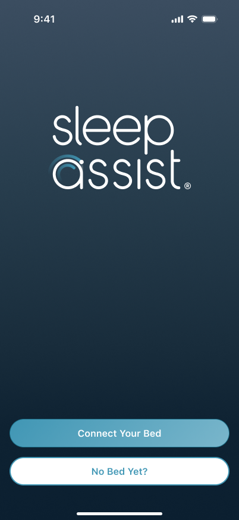

如果您已经开始连床，下一步继续看 [2.3 查找并识别您的床](#find-identify-bed)。

### 2.3 查找并识别您的床

从欢迎页进入后，先找到床，再确认床型。先试自动识别；找不到时，再扫码或手动输入设备号。确认床型后，再继续看 [2.4 按床型继续设置](#bed-type-setup)。

#### 2.3.1 自动识别

这是最推荐的方式。大多数用户都可以在这里完成识别。

1. 点击 Connect 开始找床。

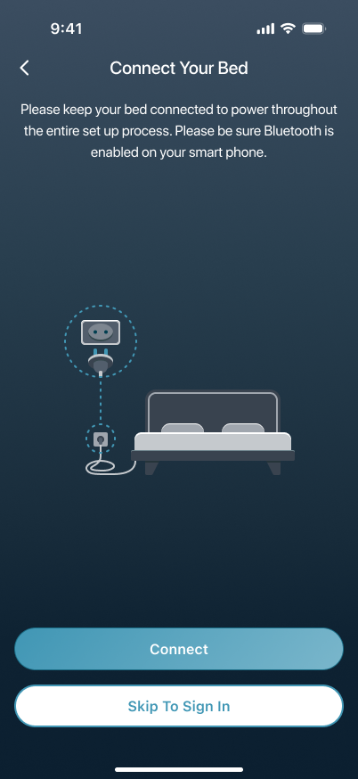

2. 如果系统请求蓝牙权限，请点击允许。否则 App 无法搜索附近可连接的床。

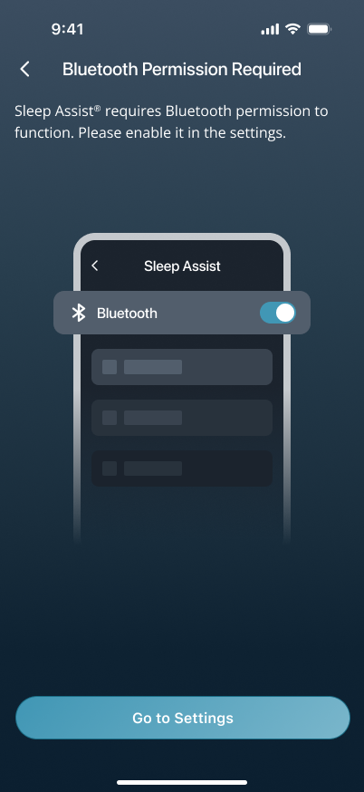

3. 等待 App 自动搜索并识别附近可连接的床。

4. 如果页面显示设备列表，请选择您的床并继续。

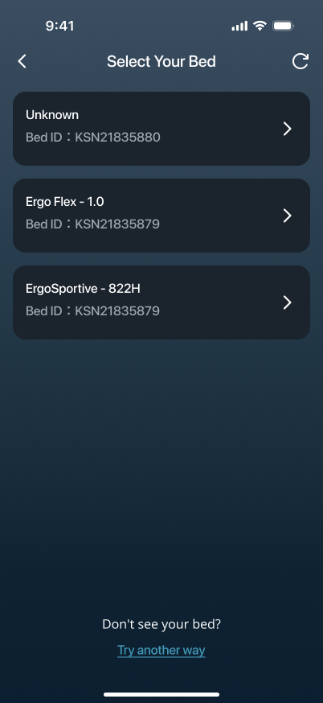

5. 如果 App 找到了设备，但还没有识别出床型，先选择您的设备，再按页面提示进入床型选择页。

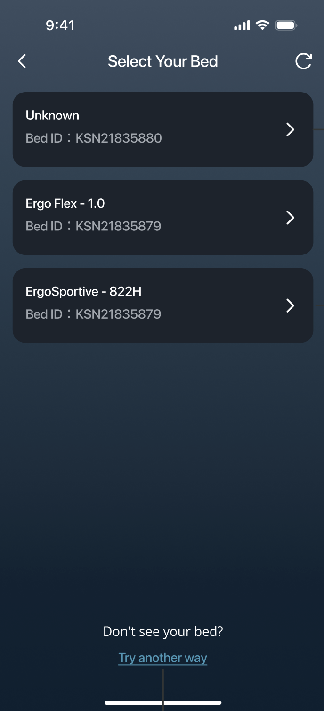

6. 在床型选择页中确认正确的床型，然后继续。

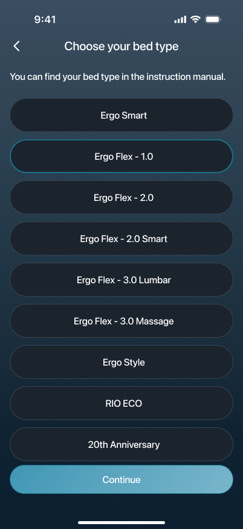

#### 2.3.2 扫码识别

如果自动识别没有找到您的床，请点击 Try another way。

1. 在 Unable to Connect 页面点击 Scan QR Code with Camera。

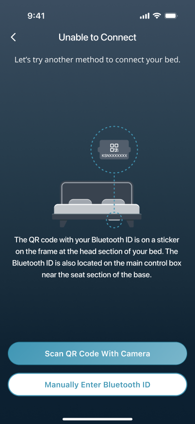

2. 如果系统请求相机权限，请点击允许。

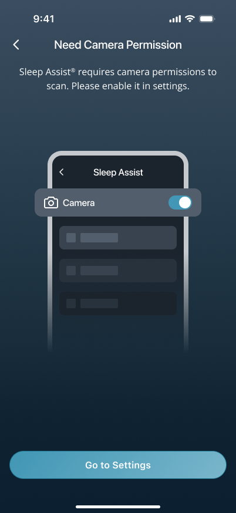

3. 将摄像头对准床体上的二维码进行扫描。

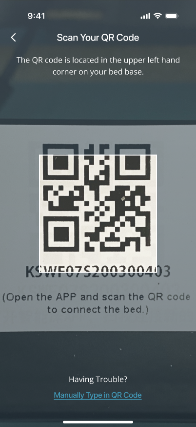

4. 连接成功后，按页面提示继续下一步。

#### 2.3.3 手动输入设备号

如果扫码不可用，或者二维码识别失败，您可以改用手动输入设备号。

1. 在 Unable to Connect 页面点击 Manually Enter Bluetooth ID，并根据图示找到设备号。

2. 在输入页填写床体上的设备号。

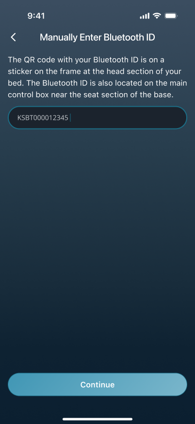

3. 确认输入无误后，继续下一步。如果输入的设备号格式不正确，页面会直接提示错误。修改后再继续即可。

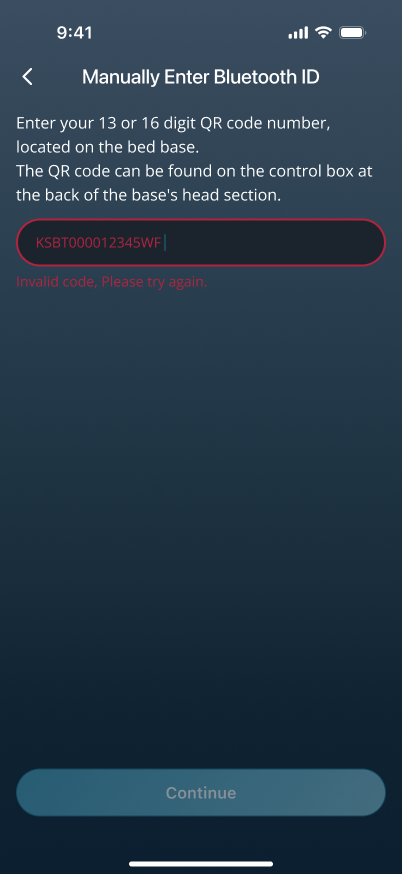

4. 识别成功后，按页面提示继续连接。

#### 2.3.4 还不想连接床

如果您现在不想连接床，可以先点击 Skip To Sign In。

如果您是第一次连床，或者这张床还没有绑定到您的账号，请继续看前面几个小节。

### 2.4 按床型继续设置

确认床型后，接下来会分成两种情况。电动床可以直接进入首页；智能床还要注册或登录账号、连接床体，再填写第一次使用的信息。

#### 2.4.1 电动床

识别到电动床后，App 会直接进入 Homepage。电动床不需要登录账号，到这里第 2 章就基本完成了。接下来您可以直接看第 3 章的 [电动床首页](#homepage-electric) 和 [遥控器](#remote)。

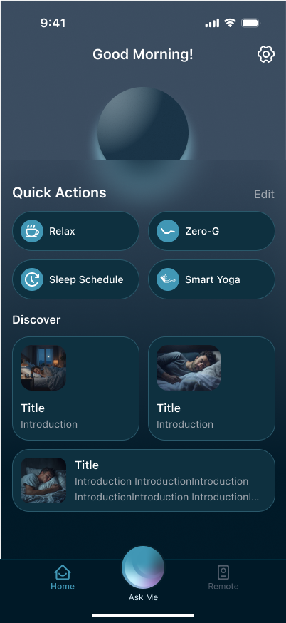

#### 2.4.2 智能床

识别到智能床后，如果您是第一次使用，请继续完成注册、床体连接和首次资料填写。下一步先看 [2.5 首次注册智能床账号](#register-account)。

### 2.5 首次注册智能床账号

这一节写给第一次用智能床、还没有账号的用户。您可以用邮箱、Apple 或 Google 注册。注册并验证后，再继续看 [2.6 设置智能床](#setup-smart-bed)。

#### 2.5.1 使用邮箱注册

如果您打算用邮箱注册，请直接在 Sign Up 页面完成。

1. 输入邮箱地址。

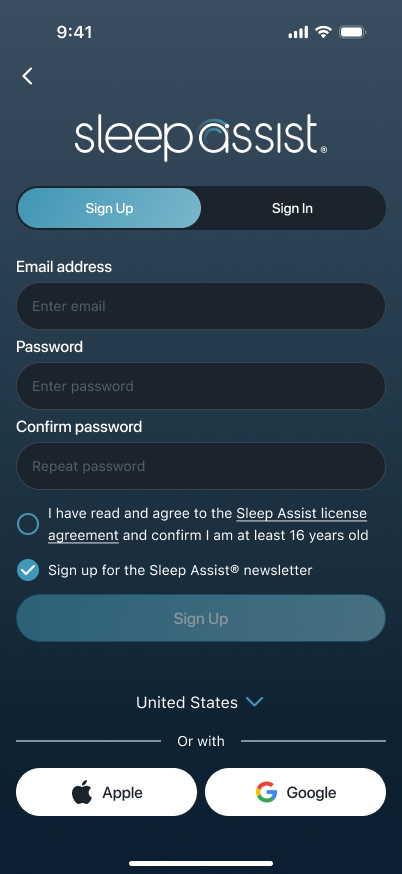

2. 设置密码并再次输入密码进行确认。

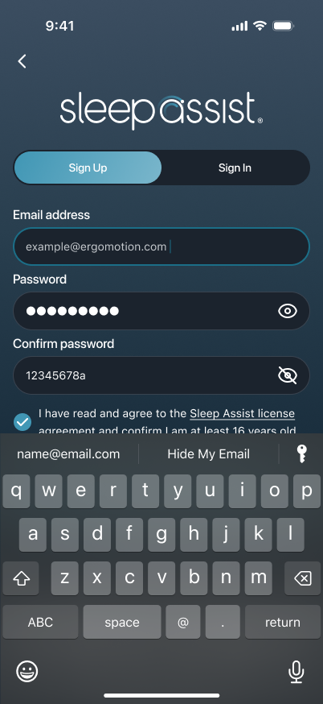

3. 选择您所在的地区。

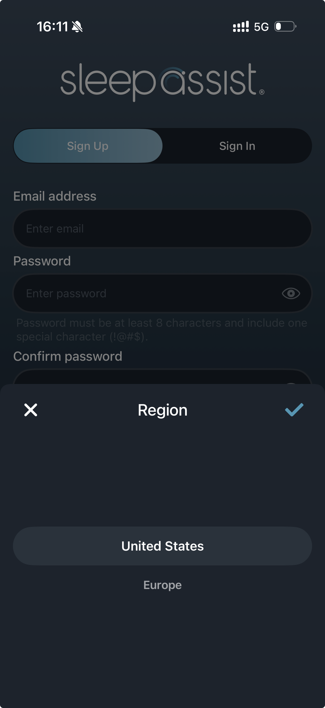

4. 勾选必要的协议确认项。

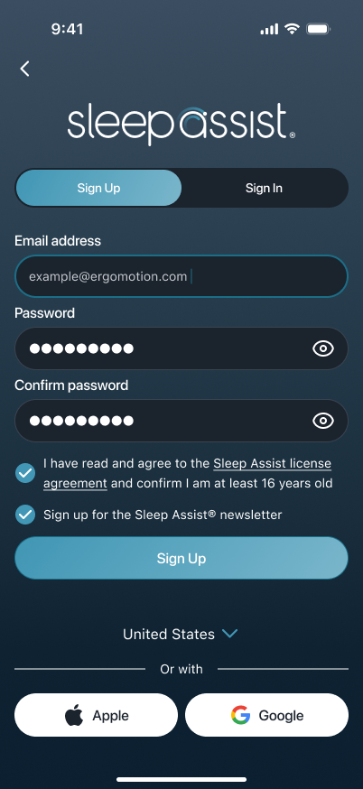

5. 点击注册按钮。

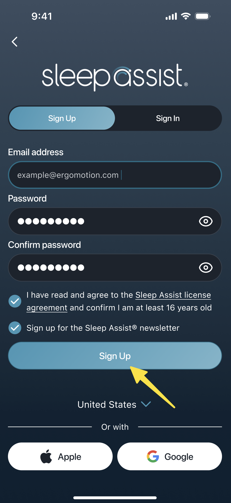

6. 查看系统发送到邮箱里的验证码，并输入验证码并完成邮箱验证。

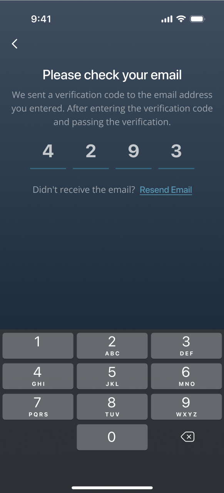

#### 2.5.2 使用 Apple 注册

如果您已经在手机上登录了 Apple 账号，可以直接点击 Apple 入口继续注册。

1. 在注册页面底部点击 Apple。

2. 按系统页面完成 Apple 授权。

3. 完成账号创建后，回到 App 继续后面的设置。

#### 2.5.3 使用 Google 注册

如果您已经在手机上登录了 Google 账号，可以直接点击 Google 入口继续注册。

1. 在注册页面底部点击 Google。

2. 按系统页面完成 Google 授权。

3. 完成账号创建后，回到 App 继续后面的设置。

### 2.6 设置智能床

账号准备好后，接着把床连好。蓝牙型和 Wi-Fi 型的设置步骤不一样，连好以后还要确认是否打开睡眠数据跟踪。做完这里，再继续看 [2.7 完成首次资料填写](#first-profile)。

#### 2.6.1 设置蓝牙型智能床

如果识别到的是蓝牙型智能床，操作会简单一些。

1. 等待 App 完成蓝牙连接。

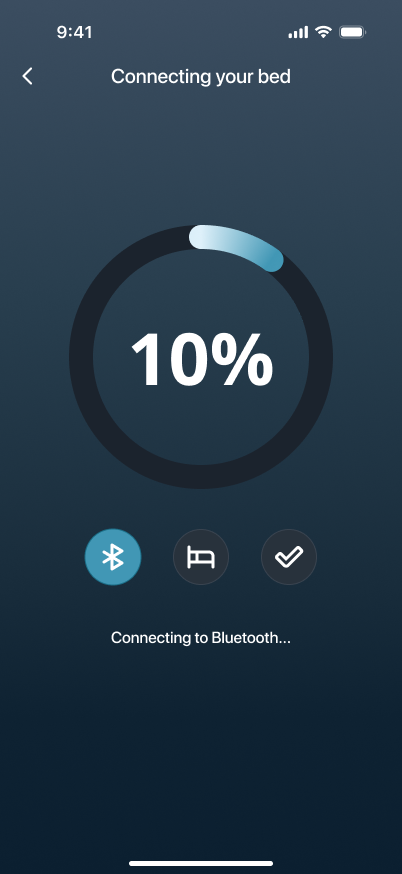

2. 等待 App 完成床体设置。

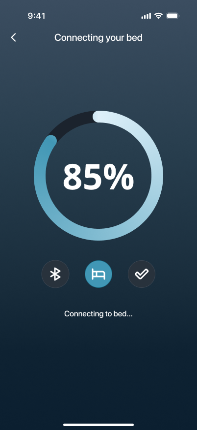

3. 连接成功后，进入睡眠追踪设置。

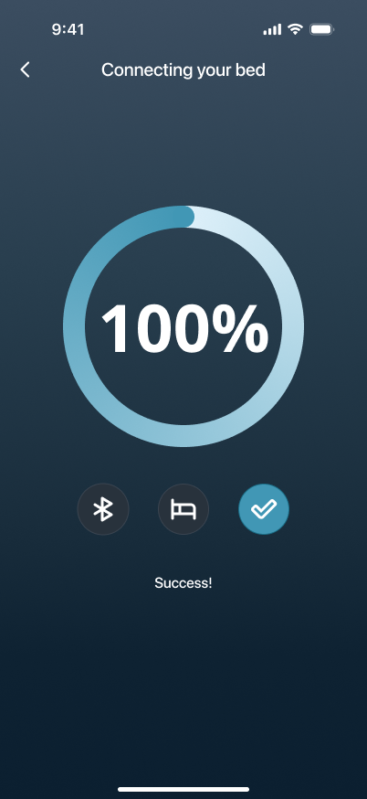

#### 2.6.2 设置 Wi-Fi 型智能床

如果识别到的是 Wi-Fi 型智能床，您还要连上家里的 Wi-Fi。

1. 选择可用的 Wi-Fi 网络。

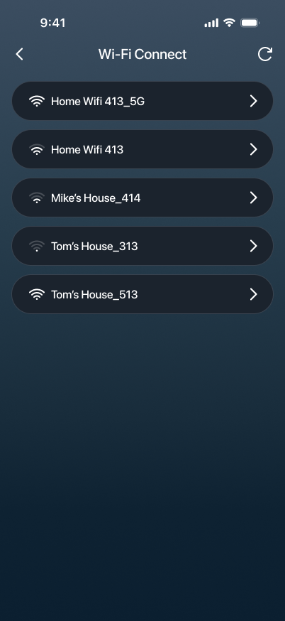

2. 输入 Wi-Fi 密码并继续。

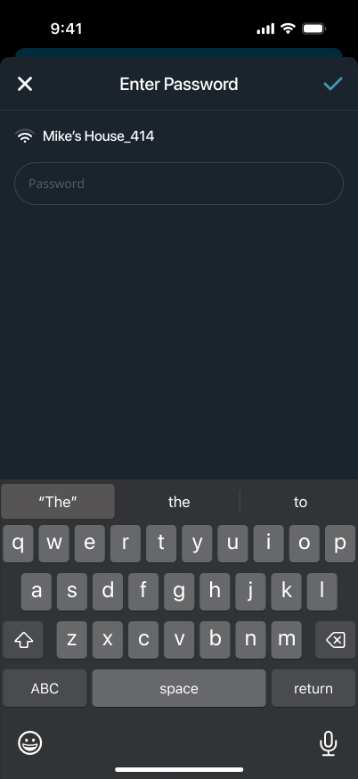

3. 等待 App 完成蓝牙连接。

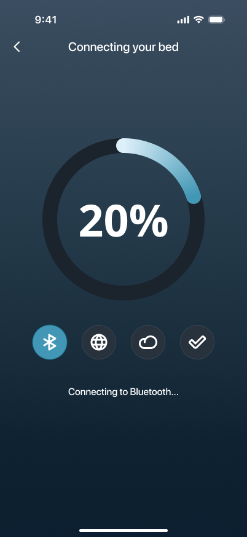

4. 等待 App 完成 Wi-Fi 连接。

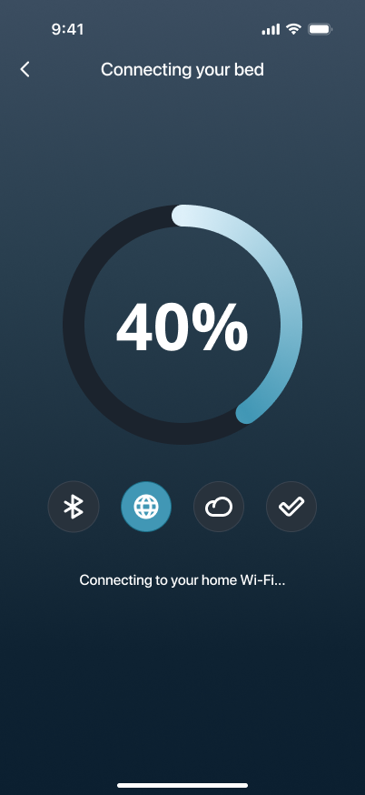

5. 等待 App 完成服务器连接。

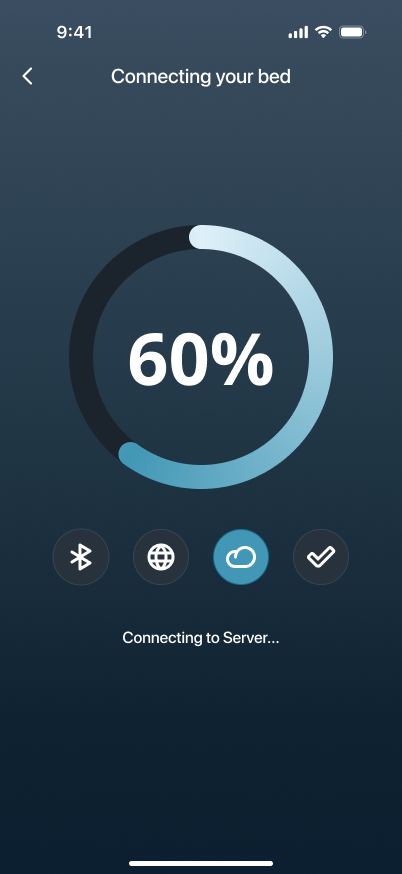

6. 连接成功后，进入睡眠追踪设置。

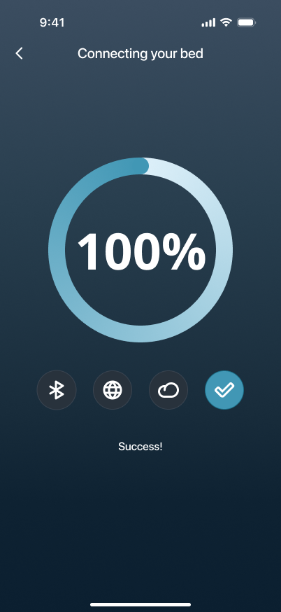

#### 2.6.3 开启睡眠数据跟踪

蓝牙型或 Wi-Fi 型智能床连好后，页面会显示 Sleep Data Tracking。

1. 先阅读页面说明。

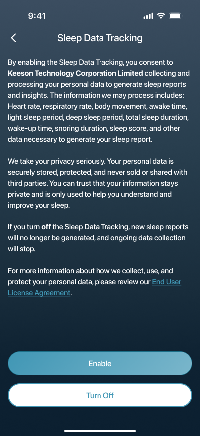

2. 选择是否开启睡眠数据跟踪。如果您关闭睡眠数据跟踪，App 将不再追踪您的睡眠数据，但同时也不会生成睡眠报告。您之后如果需要，也可以在设置中重新打开。

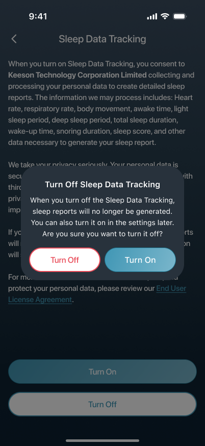

3. 点击继续，进入首次资料填写。

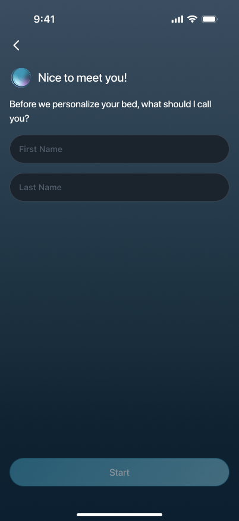

### 2.7 完成首次资料填写

床连好并确认睡眠数据跟踪后，还要补充第一次使用的信息。您需要填写昵称、基础信息、睡眠目标和个人偏好；如果床支持分区功能，页面还会多一步床边位置选择。完成这里后，您就可以进入首页，开始看 [3.2 智能床首页](#homepage-smart)。

#### 2.7.1 无分区功能智能床

1. 输入昵称。

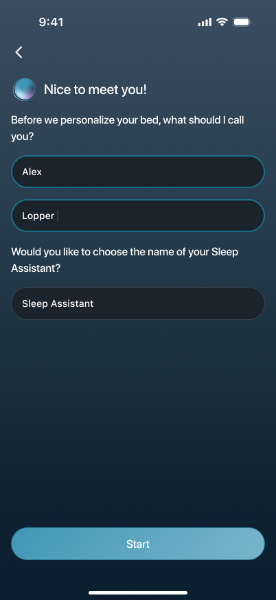

2. 阅读页面上的填写说明。

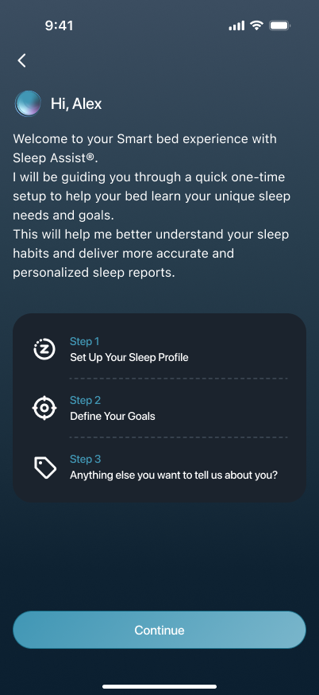

3. 进入基础信息填写页，补充性别、身高、体重、床垫厚度、生日和时间制式等内容。

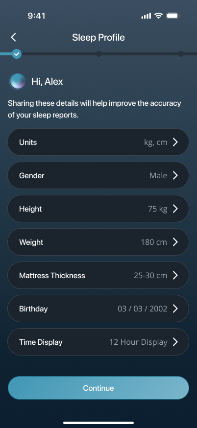

4. 完成基础信息后，进入睡眠目标页。

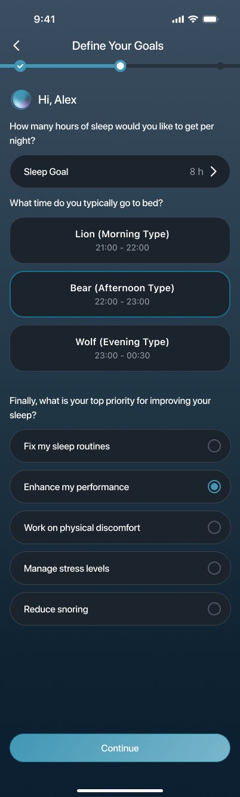

5. 继续进入个人标签页，选择适合自己的标签。您也可以点击 Skip 先跳过。

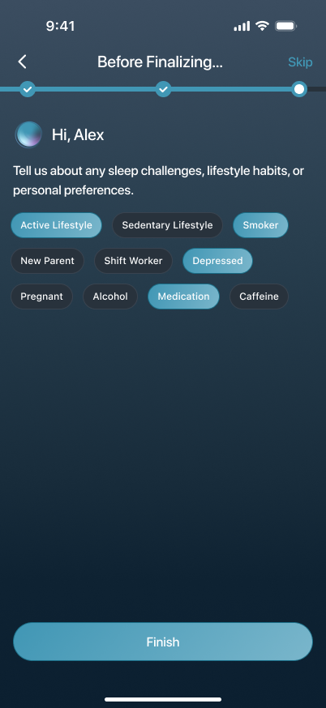

6. 完成后进入首页。

#### 2.7.2 有分区功能智能床

1. 输入昵称。

2. 阅读页面上的填写说明。

3. 先选择您的床边位置。

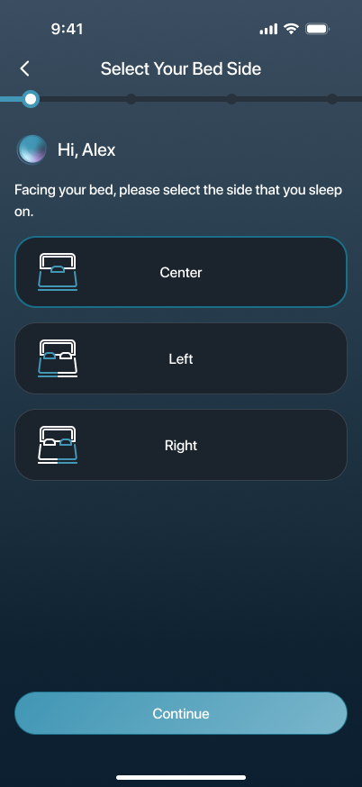

4. 进入基础信息填写页，并先确认单位设置。

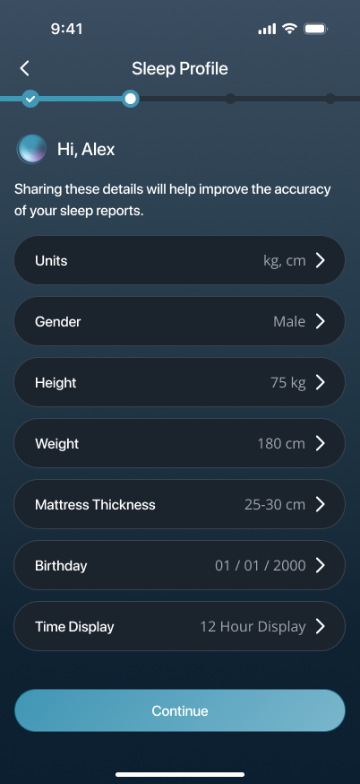

如果您调整了单位或关键字段，系统可能会短暂保存设置。

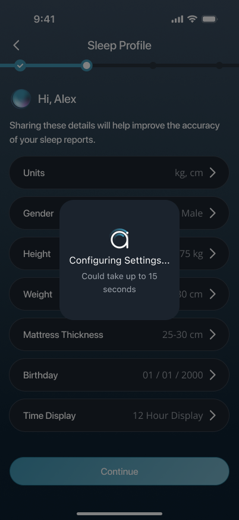

5. 完成基础信息后，继续设置睡眠目标，并选择优先改善的睡眠项。

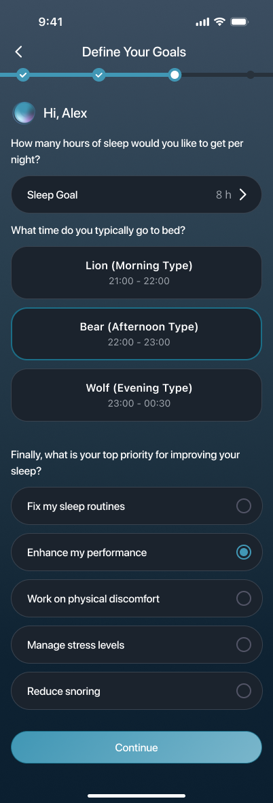

6. 进入个人标签完成页，确认后点击 Finish 进入首页。

看到首页后，第一次连接和基础设置就完成了。

## 3. 使用 App

这一章适合已经完成连床和首次设置的用户。您可以从这里开始熟悉首页、报告、实时数据、遥控器和睡眠计划这些常用功能。

### 3.1 登录

这一节主要写给智能床用户。电动床通常不需要登录账号就可以直接使用 App。

#### 3.1.1 使用邮箱登录

1. 进入 Sign In 页面。
2. 输入注册邮箱和密码。
3. 点击 Sign In。

4. 登录成功后，进入首页。

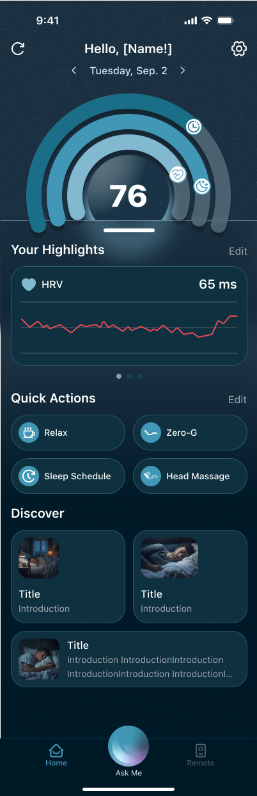

#### 3.1.2 使用 Apple 登录

如果您注册时使用的是 Apple 账号，请在 Sign In 页面点击对应入口，然后按系统提示完成授权。

1. 在 Sign In 页面底部点击 Apple。

2. 按系统页面完成 Apple 授权。

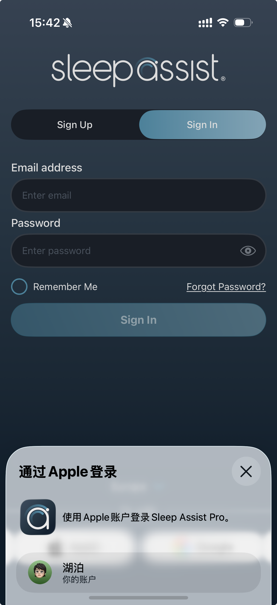

#### 3.1.3 使用 Google 登录

如果您注册时使用的是 Google 账号，请在 Sign In 页面点击对应入口，然后按系统提示完成授权。

1. 在 Sign In 页面底部点击 Google。

2. 按系统页面完成 Google 授权。

### 3.2 智能床首页

如果您连接的是智能床，首页通常会显示 Sleep Report、Your Highlights、Quick Actions 和 Settings 等入口。

您可以按下面的顺序认识首页：

#### 3.2.1 睡眠得分

1. 所选日期已经有睡眠数据，顶部会显示睡眠得分和摘要。

2. 如果您想拉取最新数据，向下拉页面进行刷新。

3. 如果您想查看其他日期的数据，点击日期后通过弹窗选择日期进行切换。

*日期入口*

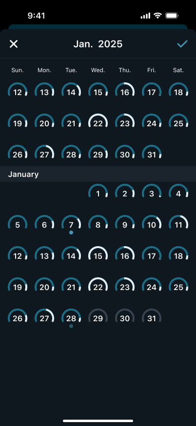

*日期弹窗*

#### 3.2.2 Your Highlights

4. 在 Your Highlights 中快速查看重点睡眠指标卡片，可以左右滑动切换卡片。

5. 如果您想调整展示内容，点击右侧的 Edit 进行调整。

6. 首页会显示排序前三的卡片，通过拖动进行编辑顺序，点击右上角的按钮保存。

#### 3.2.3 Quick Actions

7. 在 Quick Actions 中进入常用功能，例如 Real-Time Data、Sleep Schedule 或其他快捷操作。

8. 如果您想调整顺序和内容，点击右侧的 Edit。

9. 同理，首页显示顺序前四的操作，通过拖动变更顺序，点击右上角的按钮进行保存。

#### 3.2.4 其他

10. 如果您想查看更详细的分析，点击或下拉顶部的睡眠得分区域，进入 Sleep Report。

11. 如果您需要修改账号、通知、设备或其他设置，点击 Settings。

### 3.3 电动床首页

如果您连接的是电动床，首页会更偏向快捷控制。这里通常没有账号、睡眠报告、实时数据或 AI Chat 入口，主要用于快速操作床体和进入常用功能。

您可以按下面的方式使用：

1. 在 Quick Actions 中点击对应功能，直接控制床体，也可以点击 edit 编辑 Quick Actions 的功能。

2. 如果您需要使用远程操控床体的功能，可以点击底部菜单栏的 Remote 按钮。
3. 查看床体的设置可以点击右上角的设置按钮。

### 3.4 查看睡眠报告与历史数据

这一节写给智能床用户。如果首页已经显示睡眠得分或摘要，您可以直接进入 Sleep Report 查看当天报告，再继续查看具体指标的详情和趋势。

#### 3.4.1 查看睡眠报告

1. 在首页点击睡眠得分区域，或下拉进入 Sleep Report。

2. 进入报告页后，先查看当天的睡眠结果和各项指标。当前报告一共有 3 类共 9 个指标。

3. 如果您想查看其他日期的数据，先点击当前日期。

4. 在弹窗中选择目标日期，切换到对应日期的历史睡眠报告。

#### 3.4.2 查看指标详情及趋势

1. 在 Sleep Report 页面点击任意一个指标卡片，进入该指标的详情页。

2. 在指标详情页查看这个指标更详细的数据说明；如果您想继续提问，在日视图下点击 Ask me。

3. 支持切换查看该指标的周、月、年趋势。

### 3.5 查看实时数据

这一节写给智能床用户。Real-Time Data 用来查看床体当前采集到的实时身体数据。这个功能只会出现在智能床首页的 Quick Actions 里。

1. 在首页的 Quick Actions 中点击 Real-Time Data。

2. 在实时指标区查看当前数据。当前版本主要展示 Heart Rate、Respiratory Rate 和 Sleep Movement。

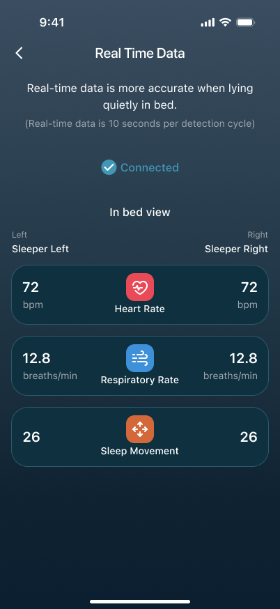

3. 如果您的床支持双人模式，页面会同时显示 Sleeper Left 和 Sleeper Right 两侧的数据。

4. 如果未连接则不会显示实时的数据，请先返回首页确认连接情况，再重新进入。

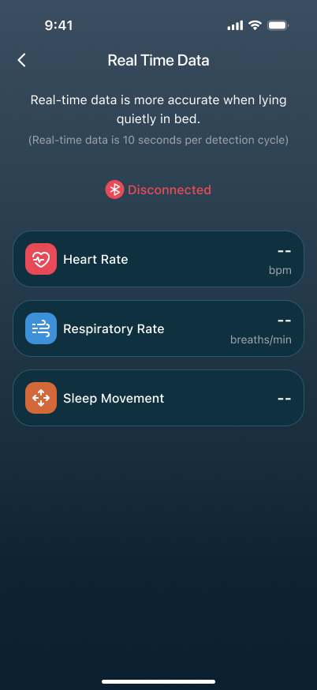

### 3.6 使用遥控器

Remote 页面主要用于直接控制床体的常用功能，例如姿态调节、按摩、预设模式和灯光。不同床型支持的功能不完全一样，页面会根据当前连接的床自动显示可用按钮。

1. 从底部导航进入 Remote 页面。

2. 如果已经连接，按页面显示的按钮使用对应功能。不同床型可操作的按钮功能可能会不一样。

*蓝牙床*

*Wi-Fi 床*

3. 如果页面显示未连接状态，请先返回首页重新连接床体，再回到 Remote。

### 3.7 使用睡眠计划

这一节写给智能床用户。您可以从 Quick Actions 进入 Sleep Schedule，设置每周重复执行的固定计划，也可以只为明天设置一次临时计划。

如果固定计划和明天临时计划同时存在，系统会优先执行明天这一次的临时计划。临时计划只生效一次，执行完成后，后续日期会继续按固定计划运行。

#### 3.7.1 进入 Sleep Schedule

从 Quick Actions 进入 Sleep Schedule。

#### 3.7.2 使用固定的睡眠计划

1. 在 Sleep Schedule 页面查看 Active Schedule 和 Weekly Schedule 两个区域。

2. 点击 Add New Schedule，然后按星期设置每天的计划。您可以把工作日和周末设置成不同作息，也可以只设置部分日期。

3. 在编辑页设置 Rest Actions 和 Rise Actions，例如床位、按摩或灯光，然后保存。床体会在您设定的休息时间和起床时间，按固定计划重复执行这些操作。

#### 3.7.3 仅为明天设置临时的睡眠计划

1. 如果您只想调整明天这一次的安排，点击 Add for Tomorrow Only 或 Change for Tomorrow Only。

2. 在编辑页设置明天这一次要执行的 Rest Actions 和 Rise Actions。保存后，系统只会在明天执行这一次临时计划。如果明天同时有固定计划和临时计划，系统会优先执行临时计划。

## 4. AI 对话

这一章写给智能床用户。AI Chat 是 App 里的文字助手。它会帮您了解床体功能、查看功能怎么用、处理基础问题，也会在合适的时候带您打开对应页面。

### 4.1 AI 现在可以帮您做什么

您可以把 AI Chat 当成一个随时可用的智能床助手。当前版本更适合帮您处理下面几类问题：

- 问床体功能是什么，例如某个模式、预设或传感功能是什么意思
- 问某个功能怎么用，例如怎么解锁、怎么设置、怎么进入某个功能
- 处理基础故障，例如床体无法移动、遥控器没有响应这类常见问题
- 识别明确的控制意图，并把您带到正确的控制入口
- 当您对睡眠数据有疑问时，解释基础数据来源，并引导您提交反馈

如果问题超出当前支持范围，AI Chat 也可能把您引导到人工客服或反馈表单。

### 4.2 进入 AI 对话

首页和指标详情页都会出现 AI 入口。

1. 在首页点击底部的 Ask me。

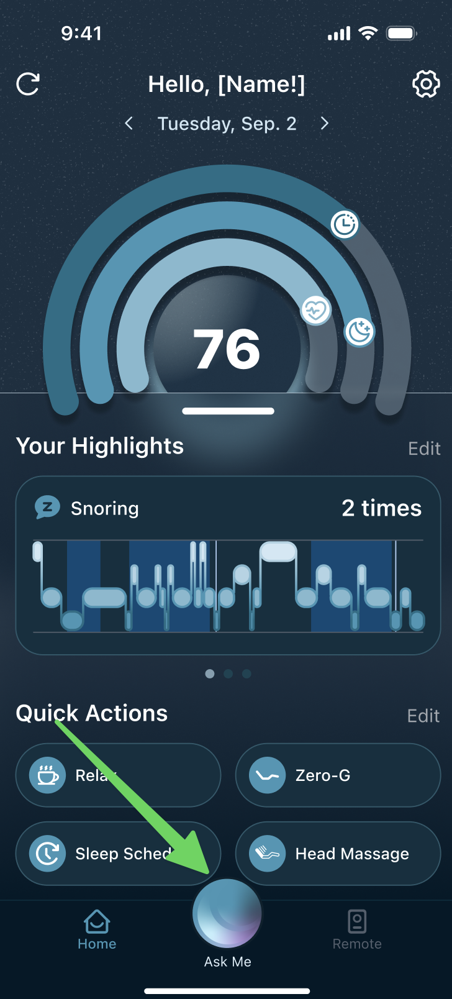

2. 在指标详情页的日报中点击 Ask me。

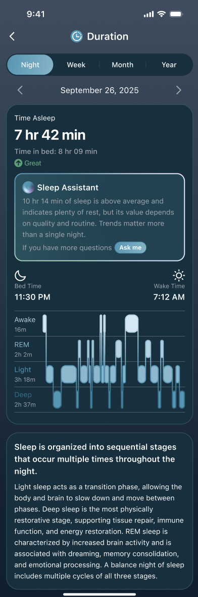

3. 进入页面后，查看推荐问题或当前已有建议。

### 4.3 查看 AI 建议并继续提问

进入 AI Chat 后，您可以先看系统给出的建议，再决定是否继续提问。提问时，尽量直接说出您现在想做什么，或者眼前遇到了什么问题。

1. 先阅读当前页面展示的 AI 建议。
2. 如果页面提供推荐问题，直接点击就可以查看回复。
3. 如果您想继续提问，直接输入问题即可。
4. 如果您不知道怎么描述，可以直接写出功能名、问题现象，或您想执行的动作。

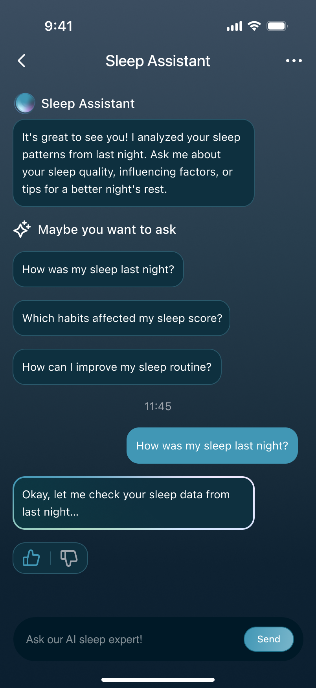

您可以直接这样问：

- What is Auto Anti-Snore Intervention?
- How do I unlock Child Lock?
- Why does my base not respond to my remote?
- Go to zero gravity.
- Why is my sleep duration incorrect?

### 4.4 AI 会怎么帮助您

根据您输入的问题不同，AI Chat 的处理方式也会不一样。您通常会看到下面几种结果：

- 如果您问的是怎么操作，AI 会按步骤告诉您下一步怎么做。

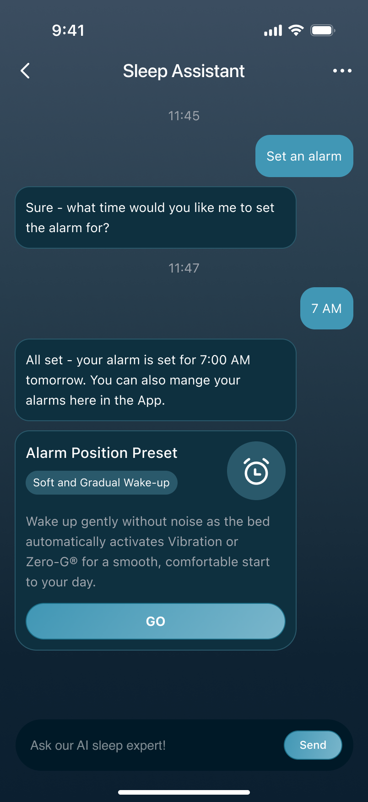

- 如果您说的是查看某个指标或是询问相关信息，AI 会列出相应的图表数据。

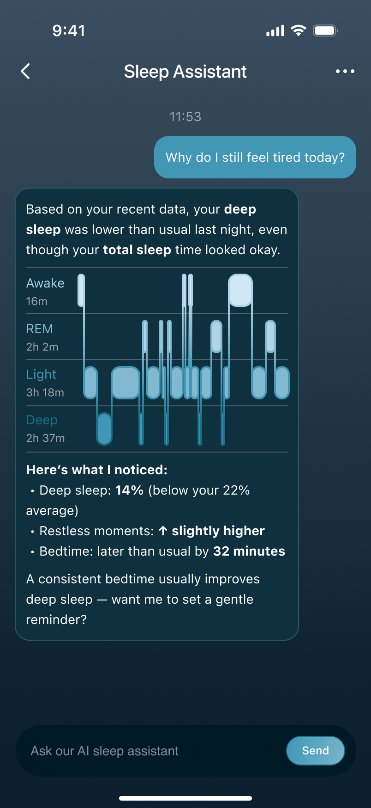

- 如果您表达的是明确操作意图，例如想让床进入某个预设，AI 可能会显示对应功能卡片，并引导您进入 Remote 页面操作。

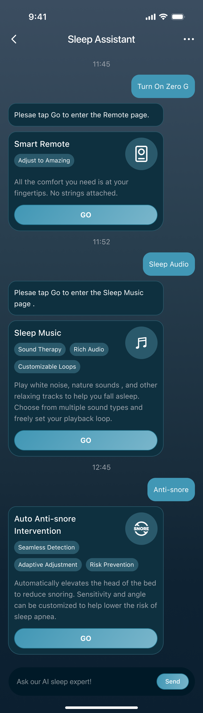

### 4.5 什么时候需要人工支持

AI Chat 可以帮助您处理常见问题，但它不是完整售后诊断工具。如果问题没有解决，页面可能会继续给您人工支持入口或反馈入口。

您更适合改用人工支持或反馈表单的情况包括：

- 按 AI 给出的基础步骤操作后，问题仍然没有解决
- 床体持续无法连接、无法移动，或重复出现同一异常
- 您需要提交具体的睡眠数据问题，帮助后续排查和校准

### 4.6 遇到问题时

如果 AI Chat 只显示基础提示，或者您觉得回复和当前情况不一致，请先检查下面几项：

- 当前是否已经连接智能床
- 当前页面是否有可用数据
- 您输入的问题里是否已经说清了功能名、问题现象或目标动作

如果 AI Chat 仍然没有给出可用结果，请先回到 [8.6 AI 内容或实时数据暂不可用](#ai-data-unavailable)，再决定是否改用人工支持或反馈表单。

## 5. 系统设置

这一章适合已经进入首页、想继续调整使用体验的用户。您可以在这里管理床体、设置睡眠偏好、同步健康数据、调整通知，并修改 AI 助手名称。

如果您使用的是电动床，通常不会看到完整的 Settings 页面。

### 5.1 打开设置

这一节会带您进入 Settings，并找到要改的项目。只要账号还保持登录，即使床体暂时没有连接，设置页一般也能打开。

1. 进入首页，点击 Settings。

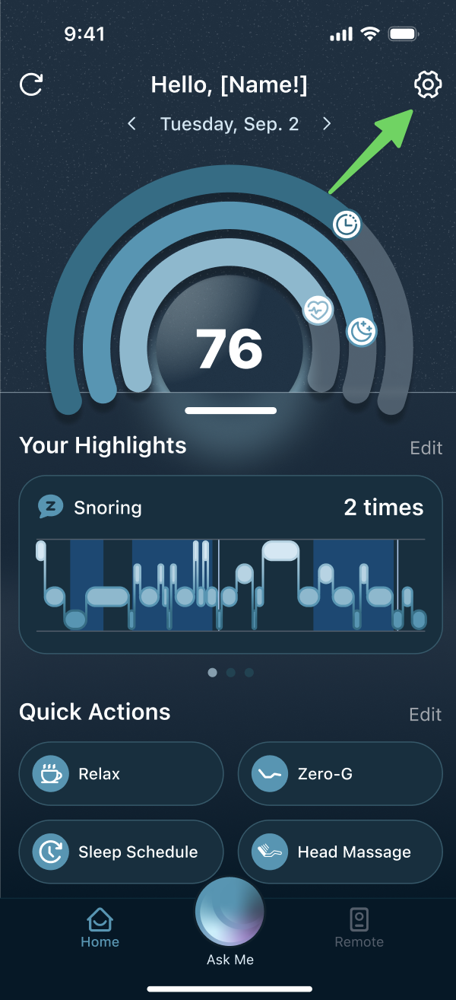

2. 进入设置页后，按您要处理的内容选择对应项目。这里一般会看到 Bed Settings、Sleep Goal、Sleeper Tags、Account & Security、Apple Health Integration、Push Notifications、AI Settings、Bed Diagnostic、Help Center、Contact Us 和 Log Out 等选项。

### 5.2 管理床体设置

这一节会带您查看 Bed Settings 里最常用的几项内容。您可以在这里调整床侧、防打鼾灵敏度和睡眠数据跟踪，也可以断开当前床体或检查硬件更新。

#### 5.2.1 进入 Bed Settings

这一页用来管理当前这张智能床的关键设置。您可以在这里确认自己正在操作哪张床，再决定要改床侧、防打鼾灵敏度、数据跟踪，还是处理断开和更新。

1. 在 Settings 页面点击 Bed Settings。

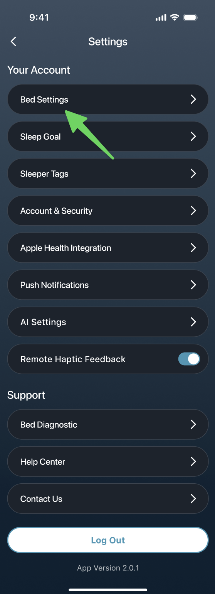

2. 进入 Bed Settings 后，先确认自己要修改的是哪一项。这个页面通常会显示 Bed Side、Anti-Snore Sensitivity、Disconnect Bed、Sleep Data Tracking 和 Hardware Update，页面底部还会显示当前床体的 Bed ID，方便您核对自己正在管理的是哪张床。

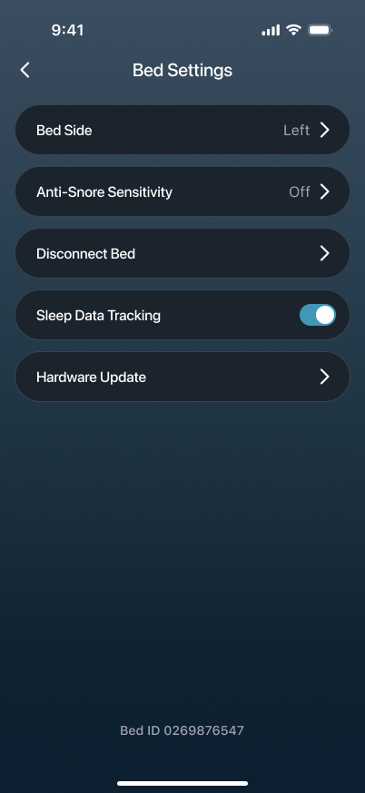

#### 5.2.2 调整床侧

如果您睡的位置和当前设置不一致，可以在这里改床侧。改对之后，后面和床侧相关的设置与数据展示会更容易对应到您自己。

1. 点击 Bed Side。
2. 在弹出的 Bed Side 面板里选择 Center、Left 或 Right。
3. 点击 Confirm 保存。

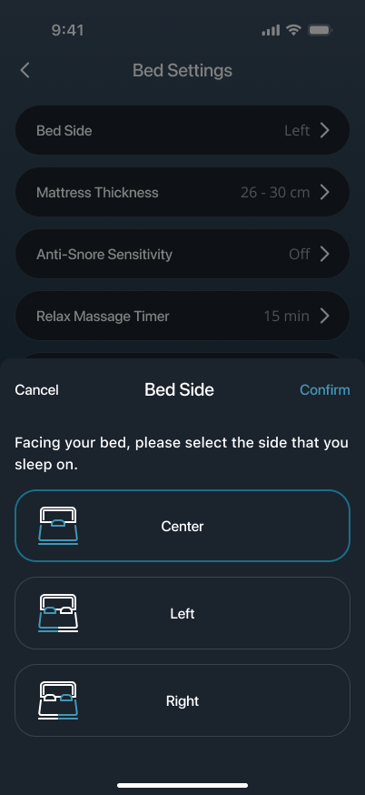

#### 5.2.3 调整防打鼾灵敏度

这一项用来控制防打鼾检测是否开启，以及触发时有多敏感。如果您希望床更容易识别到打鼾并做出反应，可以选更高的灵敏度；如果不想用这项功能，也可以直接关闭检测。

1. 点击 Anti-Snore Sensitivity。
2. 通过 Detect Snoring 开关决定是否开启防打鼾检测。
3. 如果保持开启，再选择 Low、Medium 或 High。

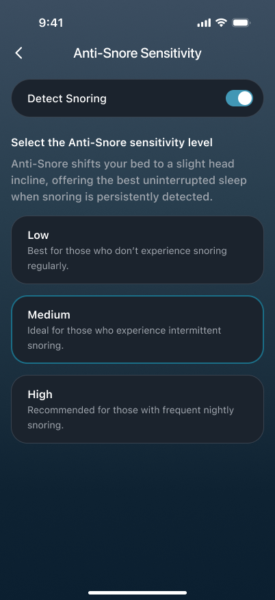

#### 5.2.4 控制睡眠数据跟踪

这一项决定床体后面的睡眠数据还要不要继续同步到 App。关闭后，您仍然可以看以前已经有的数据，但新的睡眠数据不会继续进来。

1. 留在 Bed Settings 页面。
2. 直接打开或关闭 Sleep Data Tracking 开关。

关闭后，App 不会继续记录新的床体睡眠数据；重新打开后，之后的新数据才会继续写入。

#### 5.2.5 断开当前床体

如果您不再使用当前这张床，或者准备换连另一张床，可以在这里断开。断开后，当前账号通常还能查看历史数据，但在重新连接之前，不会继续接收新的床体数据。

1. 点击 Disconnect Bed。
2. 在确认弹窗里再次阅读提示。
3. 确认无误后，点击 Disconnect。

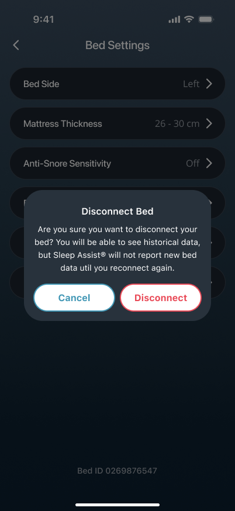

#### 5.2.6 安装硬件更新

如果这里出现 New，说明床体有新的硬件版本可装。更新通常是为了修复问题或补充能力；开始更新后，建议先留在床附近，等进度完成再离开。

1. 点击 Hardware Update。

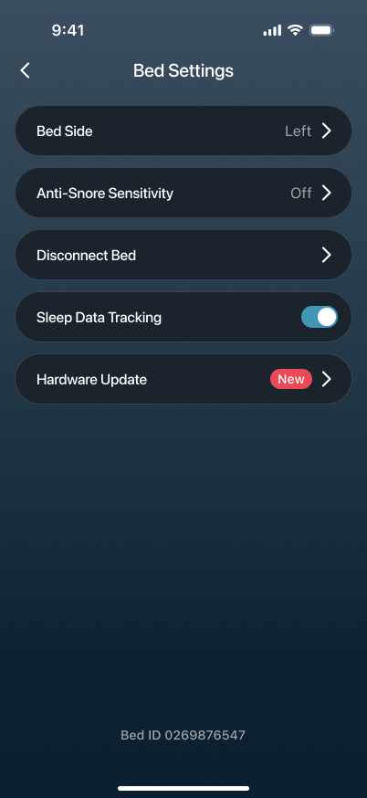

2. 在 Bed Update 弹窗中点击 Update Now。

3. 按页面提示留在床附近，等待更新进度完成。

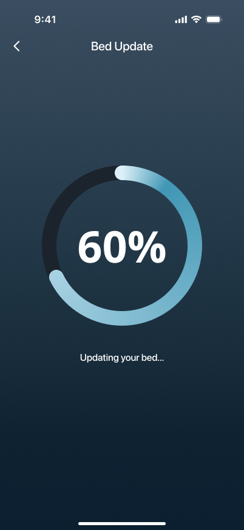

4. 如果更新失败，您可以点击 Try Again 重新开始，或点击 Later 稍后再处理。

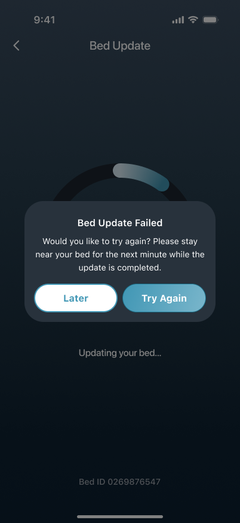

### 5.3 睡眠目标

这一节会带您设置 Sleep Goal，让 App 更贴近您的作息习惯和当前想优先改善的方向。这里主要包括目标睡眠时长、作息类型和改善重点。

#### 5.3.1 设置目标睡眠时长

这一项用来设置您希望自己每晚睡多久。设好之后，后面和睡眠计划相关的功能会更容易按您的目标来安排。

1. 在 Settings 页面点击 Sleep Goal。
2. 在 Sleep Goal 里选择您希望每晚睡多久。如果您要调整目标睡眠时长，通常会看到下面这个时间选择面板。

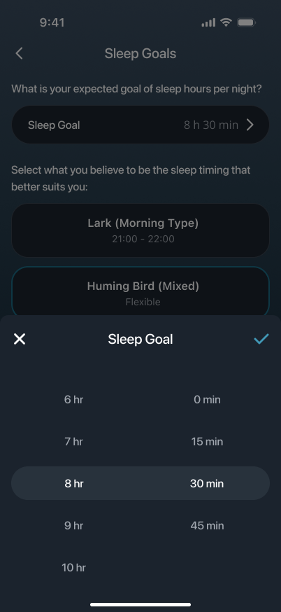

#### 5.3.2 设置作息类型和改善重点

如果您想让 App 更了解您的作息习惯和当前最在意的问题，可以在这里补充作息类型和改善重点。这些内容更偏向个性化设置，不需要一次想得特别复杂，先选最接近自己的就可以。

1. 在作息类型里选择最接近自己的类型，例如 Lion、Bear 或 Wolf。
2. 在改善目标里选择您当前最想优先改善的一项。
3. 点击 Confirm 保存。

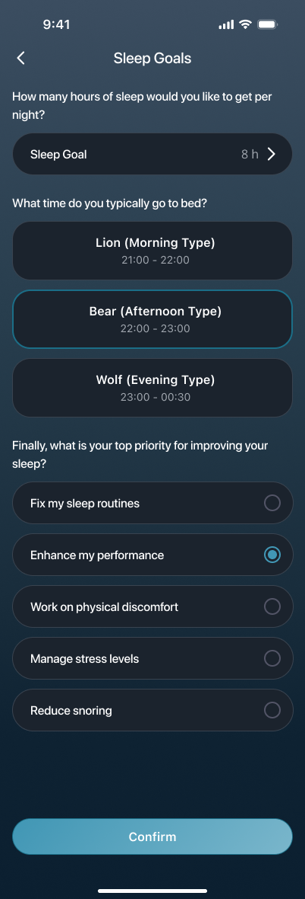

### 5.4 个人标签

这一页用来补充您的睡眠习惯、生活方式和个人偏好。选得越贴近自己，后面看到的内容和建议通常也会更贴近您的实际情况。

1. 在 Settings 页面点击 Sleeper Tags。
2. 选择与自己情况相符的标签，例如生活习惯、睡眠挑战或个人偏好。
3. 点击 Confirm 保存。

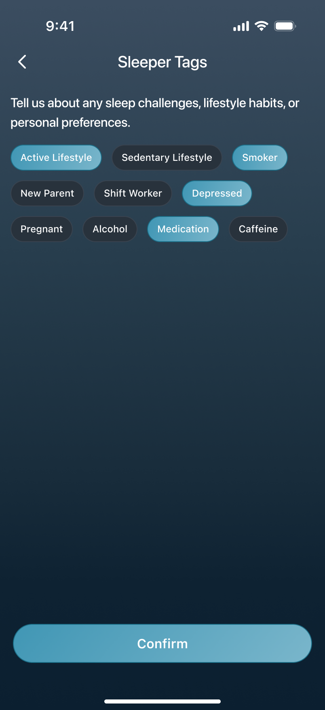

### 5.5 Apple Health Integration

如果您使用的是 iPhone，并且希望把 SleepAssistPro 里的相关数据同步到 Apple 健康，可以在这里打开集成。打开后会进入 Apple 的授权流程；如果以后关闭，只会停止后续写入，不会删除已经写进去的历史数据。

1. 在 Settings 页面点击 Apple Health Integration。

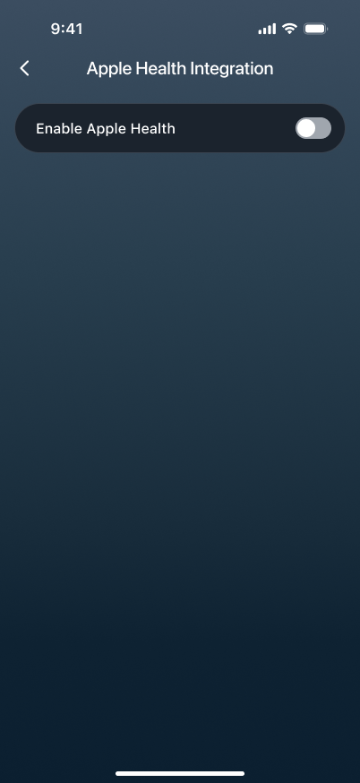

2. 进入 Apple 健康授权页后，按页面提示打开需要的权限，然后选择允许。

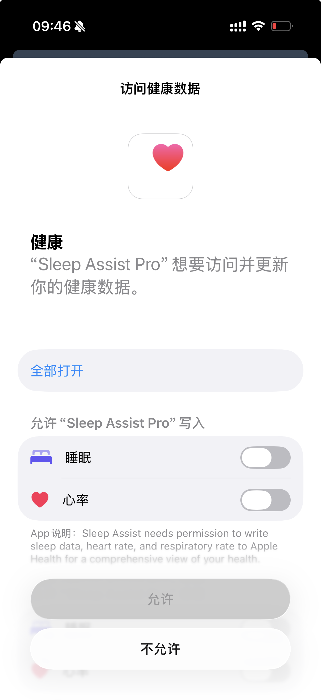

3. 打开成功后，页面会显示已开启状态。之后如果您关闭这个开关，系统不会再继续写入新的健康数据，但已经写入的历史数据不会被删除。

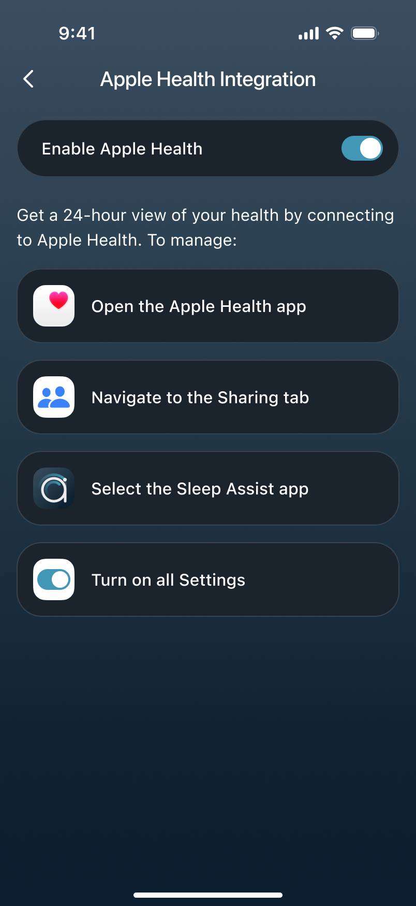

### 5.6 Push Notifications

这一节会带您统一调整通知方式，包括早晚提醒、同步提醒，以及通过邮箱接收睡眠报告。您可以按自己的作息习惯决定哪些提醒要开，哪些不用开。

#### 5.6.1 打开通知权限

如果总通知权限没有打开，后面的早晚提醒和同步提醒都不会正常发送。所以建议先把这一项处理好，再继续看下面几个通知设置。

1. 在 Settings 页面点击 Push Notifications。
2. 先打开 Receive Push Notifications。如果系统弹出通知权限提示，请按提示允许；如果没有弹窗，请前往手机系统设置开启通知权限。

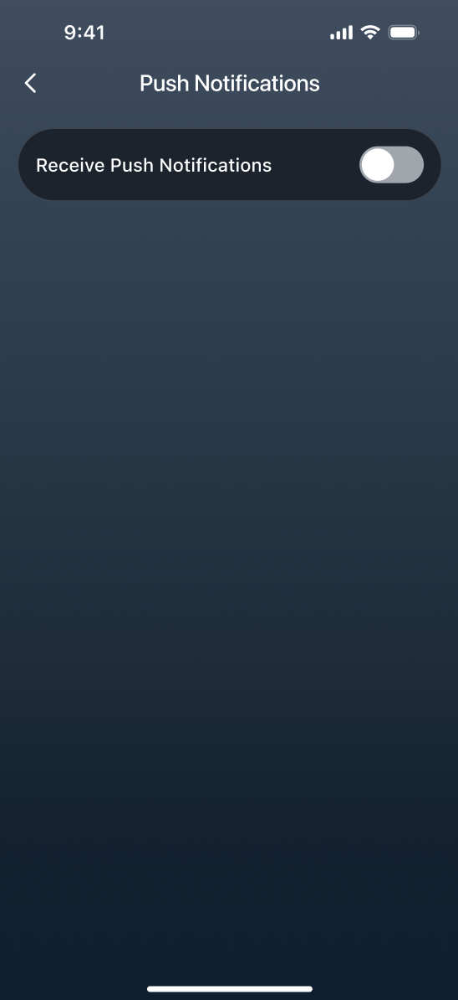

#### 5.6.2 设置早晨提醒

这一项适合想在早上固定时间回看睡眠报告的用户。您可以决定要不要提醒，以及具体几点提醒更合适。

1. 如果您想在早上收到查看睡眠报告的提醒，请按需要打开或关闭 Morning Notifications。
2. 在 Morning Notifications Time 里选择提醒时间。

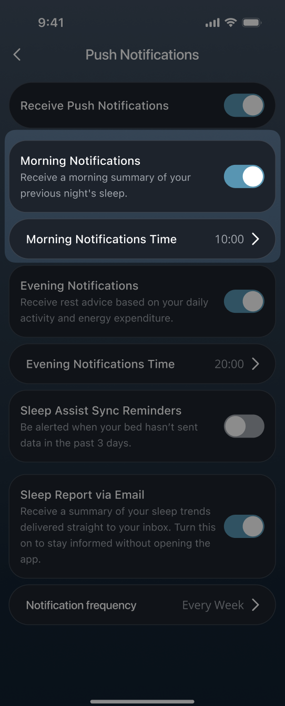

#### 5.6.3 设置晚上提醒

如果您希望在晚上固定时间收到准备休息的提醒，可以在这里设置。这个提醒更适合想把作息慢慢调稳定的用户。

1. 如果您想在晚上收到入眠提醒，请按需要打开或关闭 Evening Notifications。
2. 在 Evening Notifications Time 里选择提醒时间。

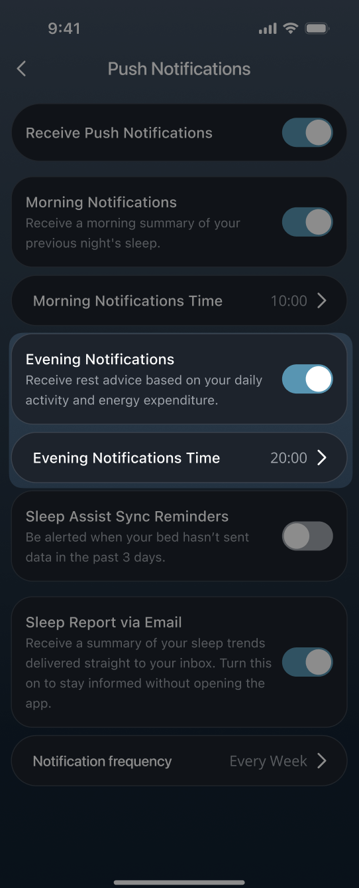

#### 5.6.4 设置同步提醒

如果您担心床体连续几天没有把数据同步到 App，可以打开这一项。这样出现长时间未同步时，您会更早发现。

1. 如果您想在床体连续几天没有同步数据时收到提醒，请打开 Sleep Assist Sync Reminders。

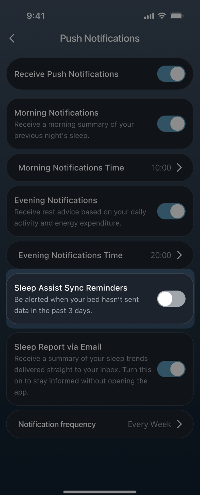

#### 5.6.5 设置邮件报告

如果您更习惯在邮箱里查看睡眠报告入口，可以打开这一项。设置好频率后，系统会按您选的节奏把报告发到邮箱。

1. 如果您想通过邮箱接收网页版睡眠报告入口，请打开 Sleep Report via Email。
2. 在 Notification frequency 里选择频率。系统会按您选择的频率，把睡眠报告发送到您的邮箱。

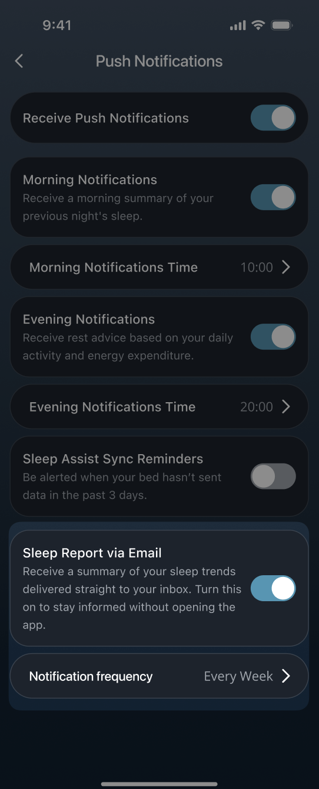

### 5.7 AI Settings

这一页用来修改 AI 助手的显示名称。如果您想让 AI Chat 页面里的助手称呼更符合自己的习惯，可以在这里直接改。

1. 在 Settings 页面点击 AI Settings。
2. 点击 Sleep Assistant's Name。
3. 输入您想使用的名称，进入名称编辑页后通常会看到下面这个输入页面。

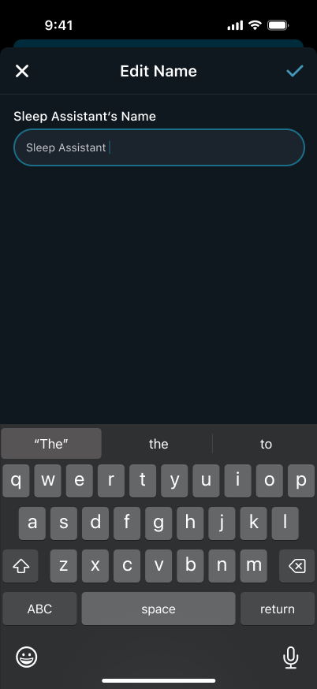

4. 按页面提示保存并返回。修改完成后，AI Chat 页面会显示新的 AI 助手名称。

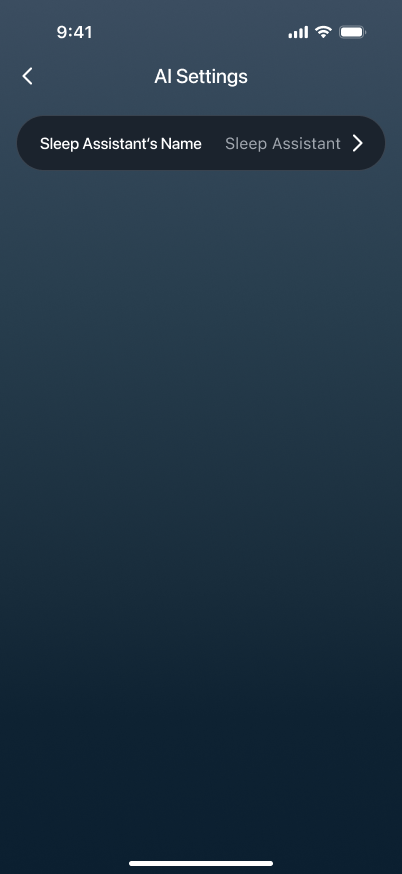

## 6. 账号与安全

这一章主要写已经登录账号后的常用账号操作。如果您想修改昵称、单位、身高体重或语言设置，管理睡眠数据和分享内容，打开 FaceID 登录，修改或找回密码，或者切换账号退出登录，都可以在这里完成。如果您准备删除账号，也建议先看这一章，先确认删除后会有什么影响，再决定是否继续。

### 6.1 修改个人资料

如果您想更新昵称、单位、身高体重或语言设置，请先进入 Account & Security，再打开 Personal Information。这些内容会影响您在 App 里的个人显示，以及部分数据的展示方式。

#### 6.1.1 进入 Account & Security

1. 先进入 Settings，然后点击 Account & Security。

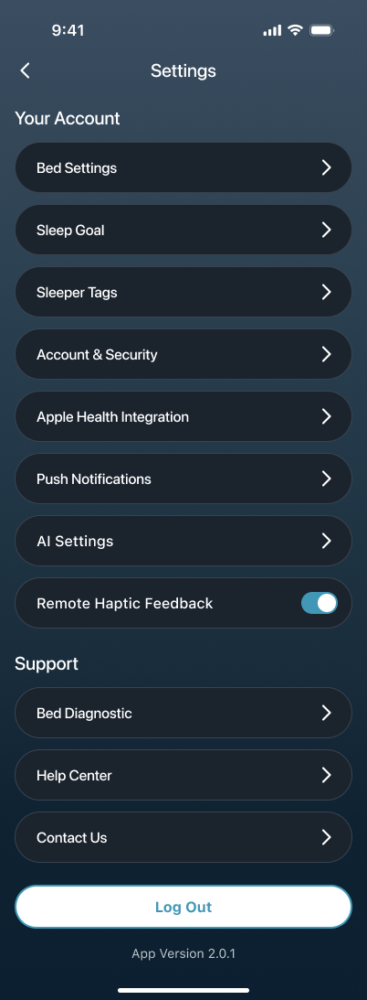

*Settings*

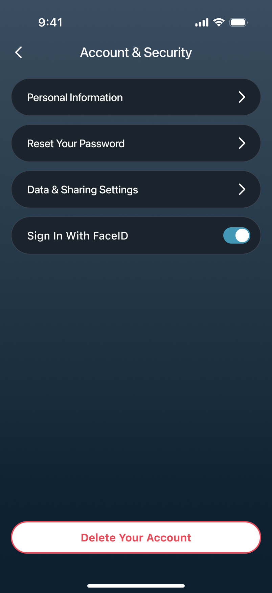

*Account & Security*

#### 6.1.2 修改个人信息

1. 点击 Personal Information，进入个人信息页面。

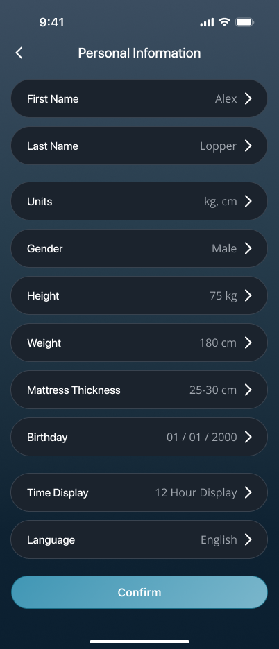

2. 修改需要更新的内容。
3. 点击页面底部的 Confirm。

如果您要同时修改单位和身体数据，建议先调整 Units，再继续填写后面的项目。这样后面的身高、体重等内容会更容易核对。

#### 6.1.3 修改语言

如果您只想切换 App 的显示语言，也是在 Personal Information 页面完成。

1. 点击 Personal Information，进入个人信息页面。

2. 找到 Language。
3. 选择您要使用的语言。
4. 点击页面底部的 Confirm。

### 6.2 管理睡眠数据与分享

如果您想删除睡眠数据、下载数据，或查看分享内容，请先进入 Account & Security，再打开 Data & Sharing Settings。这一页用来管理您自己的睡眠记录，以及别人分享给您的报告。

#### 6.2.1 进入 Account & Security

1. 先进入 Settings，然后点击 Account & Security。

*Settings*

*Account & Security*

#### 6.2.2 进入 Data & Sharing Settings

1. 在 Account & Security 页面点击 Data & Sharing Settings，进入数据与分享设置页面。

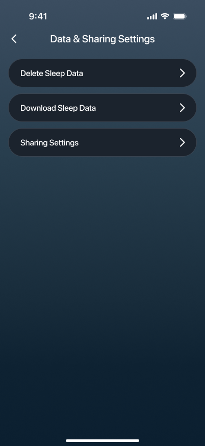

#### 6.2.3 删除睡眠数据

如果您只想删除某些日期的睡眠记录，可以使用 Delete Sleep Data。

1. 点击 Data & Sharing Settings。
2. 点击 Delete Sleep Data，页面会先让您选择要删除的日期。

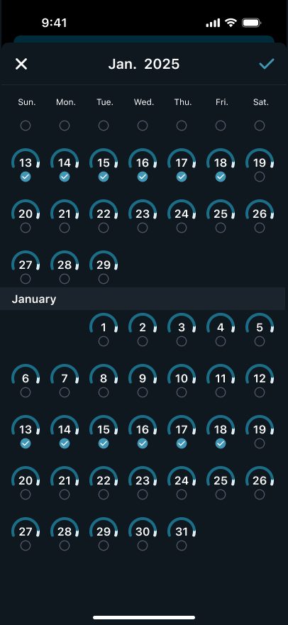

3. 选择要删除的日期后，再进入确认弹窗继续操作。

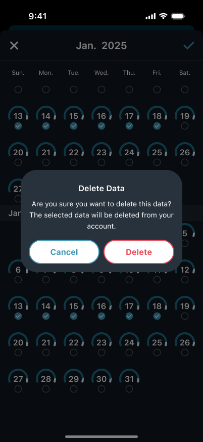

#### 6.2.4 下载睡眠数据

如果您想自己保存一份睡眠记录，可以按下面的路径进入。

1. 点击 Data & Sharing Settings。
2. 点击 Download Sleep Data，再按页面提示继续。

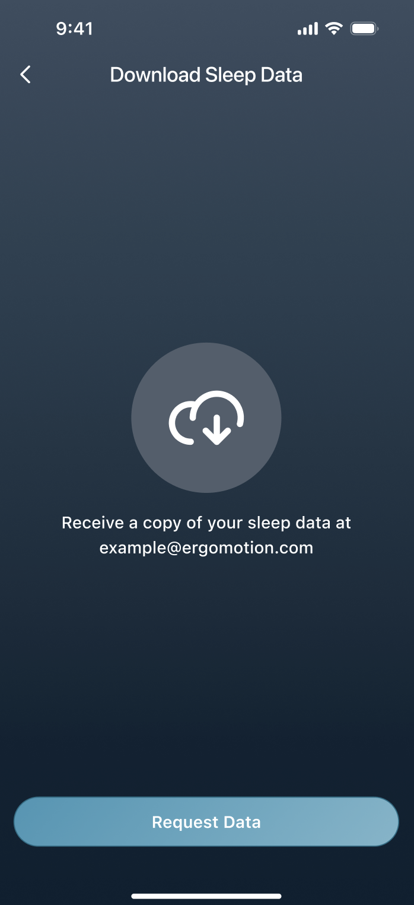

#### 6.2.5 查看与管理分享

如果您要查看别人分享给您的报告，或把自己的睡眠报告分享给别人，可以按下面的路径进入。

1. 点击 Data & Sharing Settings。
2. 点击 Sharing Settings。

如果您进入 Sharing Settings，通常会看到下面这个页面。您可以在这里查看分享给您的内容，也可以管理自己的分享操作。

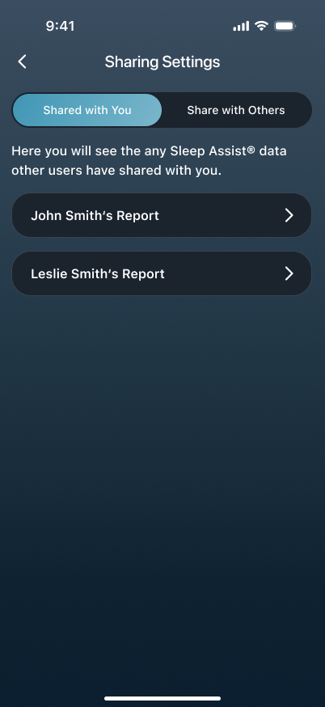

### 6.3 FaceID 登录验证

如果您的设备支持 FaceID，您可以在 Account & Security 打开 Sign In With FaceID。打开后，后续登录时会先进行 FaceID 验证，验证通过后才能进入 App。

#### 6.3.1 进入 Account & Security

1. 先进入 Settings，然后点击 Account & Security。

*Settings*

*Account & Security*

#### 6.3.2 打开 FaceID 登录验证

1. 找到 Sign In With FaceID。
2. 按页面提示打开这项设置。

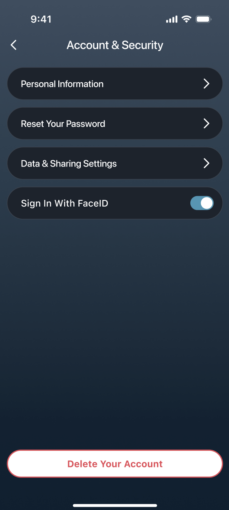

3. 如果系统请求 FaceID 权限，按提示允许，或前往手机系统设置完成授权。
4. 下次登录时，先完成 FaceID 验证，再进入 App。

### 6.4 修改或找回密码

这一节分两种情况。如果您还记得当前密码，可以直接在 App 里修改；如果已经忘了，直接用邮箱找回会更方便。

#### 6.4.1 进入 Account & Security

1. 先进入 Settings，然后点击 Account & Security。

*Settings*

*Account & Security*

#### 6.4.2 还记得当前密码时

如果您还记得当前密码，请在 Account & Security 里直接修改。

1. 点击 Reset Your Password，进入 App 内修改密码的页面。

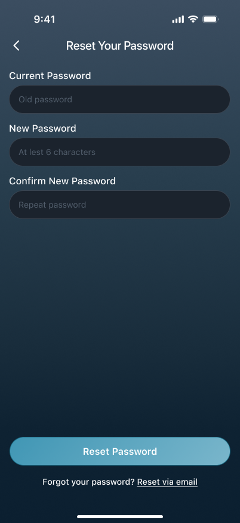

2. 在 Current Password 输入当前密码。
3. 在 New Password 输入新密码。
4. 在 Confirm New Password 再输入一次新密码。
5. 点击 Reset Password。

页面上的新密码提示为至少 6 位。修改完成后，下次登录请使用新密码。

#### 6.4.3 已经忘记密码时

如果您已经忘记当前密码，请不要继续反复尝试旧密码，直接使用邮箱找回会更快。

1. 点击页面底部的 Reset via email。
2. 在验证码页输入邮件里的验证码。

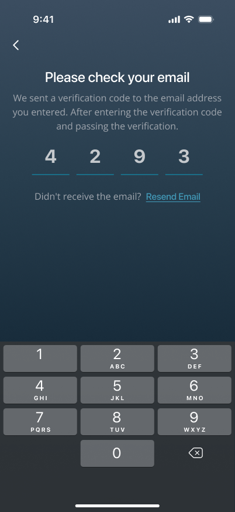

3. 在 Create a new password 页面重新设置密码。

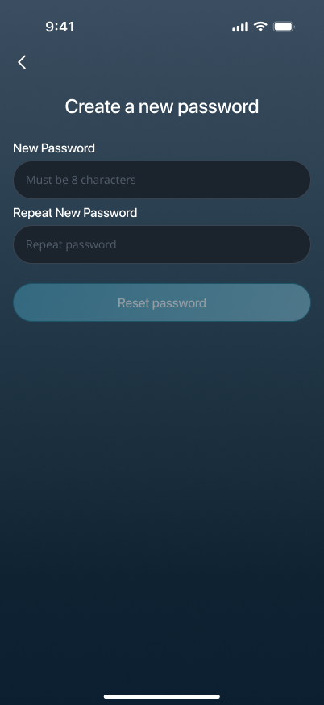

4. 设置完成后，系统通常会回到 Sign In 页面，再用新密码登录。

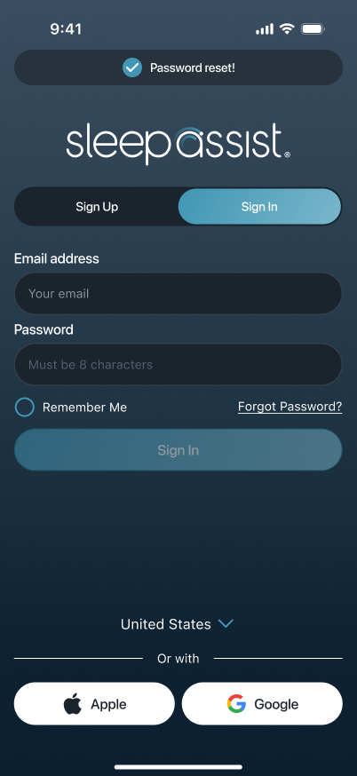

### 6.5 删除账号前先确认

删除账号会同时删除全部数据，并自动退出登录。这个操作通常不能恢复，请先确认自己确实不再使用这个账号。

#### 6.5.1 进入 Account & Security

1. 先进入 Settings，然后点击 Account & Security。

*Settings*

*Account & Security*

#### 6.5.2 删除前先看这些情况

在您确认删除前，建议先看下面几项：

- 如果您还想保留自己的睡眠数据，先打开 Download Sleep Data。
- 如果您只是想删除部分睡眠数据，先打开 Delete Sleep Data。
- 如果您只是暂时不想继续使用 App，退出登录通常比删除账号更合适。
- 如果您只是想换密码或打开 FaceID，优先使用 Reset Your Password 或 Sign In With FaceID，不要直接删除账号。

#### 6.5.3 确认删除时

如果您确认要删除账号，再按下面的步骤操作：

1. 找到页面底部的 Delete Your Account。
2. 再次阅读页面提示，确认页面内容与您的预期一致。

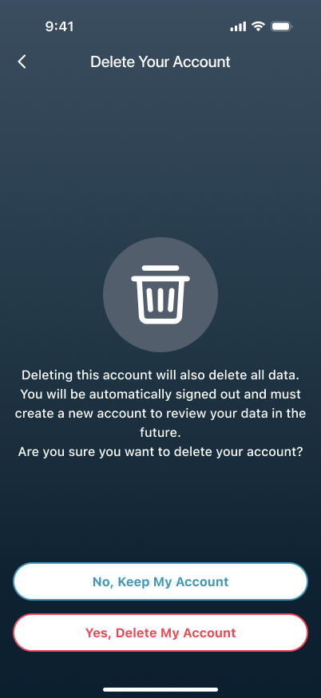

3. 确认无误后，再按页面提示完成删除。

### 6.6 退出登录

如果您需要切换账号，或者暂时不想继续保持登录，可以在设置页底部退出。退出后，App 不会继续保留当前账号的登录状态。

1. 打开 Settings。
2. 滑到页面底部。
3. 点击 Log Out。
4. 按页面提示完成退出。

退出后，您需要重新登录，才能继续使用账号相关功能和智能床数据。

## 7. 获取帮助与联系支持

这一章整理了需要帮助时最常用的几个地方。如果您想先检查床体状态、查看说明，或者直接联系支持团队，都可以从这里开始。相关内容都在 Settings 页面的 Support 区域。

### 7.1 运行床体诊断

如果您怀疑床体运行异常，可以先运行一次 Bed Diagnostic。

1. 在 Settings 页面点击 Bed Diagnostic。
2. 确认床体周围安全后，点击 Run Bed Diagnostic Test。

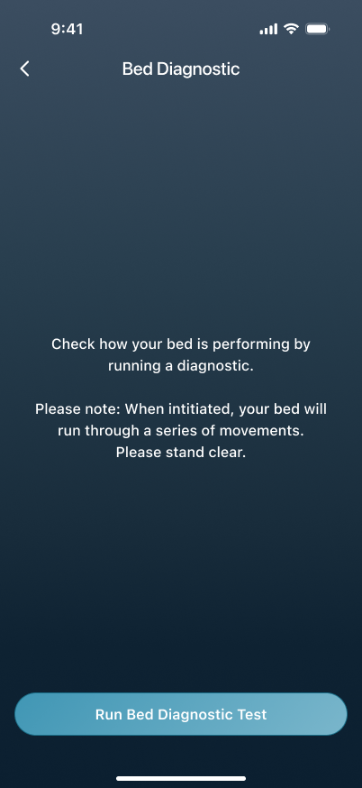

3. 等待诊断完成，再查看结果。

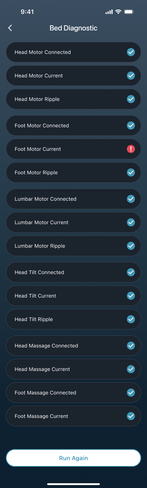

### 7.2 打开帮助中心

如果您想查看说明内容，可以打开 Help Center。

这里一般会看到 User Manual、FAQs 和 End User License Agreement。您可以按需要打开对应页面继续查看。

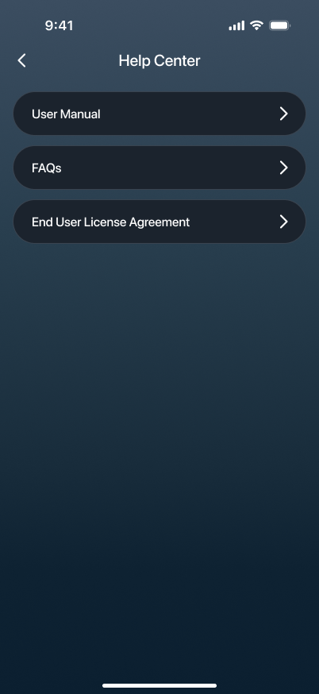

### 7.3 联系支持团队

如果您需要人工帮助，可以打开 Contact Us。

1. 在输入框里写下您遇到的问题。
2. 按需要检查页面上的邮箱相关选项。
3. 点击 Send Message 提交。

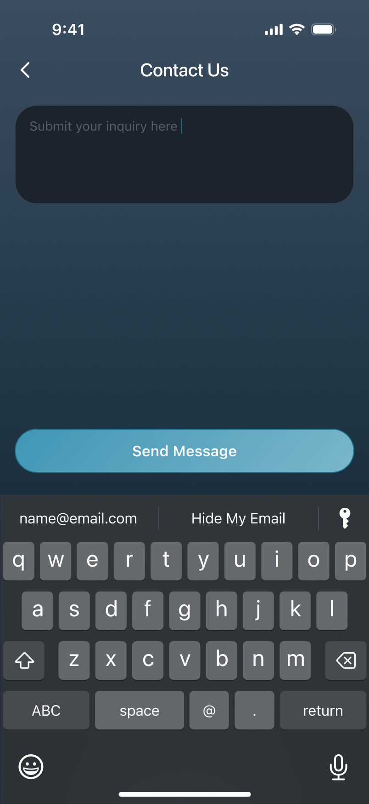

为了让支持团队更快理解您的问题，建议在消息里写清您看到的现象、问题发生的时间，以及您已经试过哪些操作。

## 8. 常见问题与排查

这一章整理了最常见的问题。如果您在连接、登录、查看报告或使用 AI 时遇到问题，可以直接按眼前的情况查找对应小节。先看最接近您当前情况的标题，通常会更容易找到能直接照着做的办法。

### 8.1 搜索不到床或连接失败

如果 App 搜索不到床，或者连床时卡住不往下走，请按下面的顺序检查：

#### 8.1.1 先检查连接条件

1. 确认床体已经通电，并且手机靠近床体。
2. 重新进入找床流程，再次搜索。

#### 8.1.2 自动识别失败时

1. 如果自动识别失败，改用 Scan QR Code with Camera 扫码识别。
2. 如果扫码仍不可用，再改用手动输入设备号。
3. 如果页面进入床型选择页，请手动确认正确的床型后继续。

如果还是连不上，再继续看 [8.2 权限未开启怎么办](#permissions)。

### 8.2 权限未开启怎么办

第一次连床时，App 可能会请求蓝牙、位置和相机权限。

- 蓝牙权限会影响设备搜索和连接。
- 位置权限会影响附近设备扫描。
- 相机权限会影响二维码扫描。

如果您点了“不允许”，页面可能会卡在搜索、扫码或识别。请先打开手机系统设置，给 App 补上权限，再回到 App 重试。

### 8.3 Wi-Fi 型智能床连接失败

如果 Wi-Fi 型智能床卡在 Wi-Fi 或服务器连接这一步，请按下面的顺序处理：

1. 确认所选 Wi-Fi 网络正确。
2. 确认输入的 Wi-Fi 密码无误。
3. 让手机保持在床体附近，等待 App 完成蓝牙、Wi-Fi 和服务器连接。
4. 如果页面长时间没有变化，返回上一步，重新选择 Wi-Fi 后再次尝试。
5. 如果仍然失败，请重新开始找床和设置。

### 8.4 首页显示未连接

如果首页显示未连接，说明 App 当前没有连上床体。您可以按下面的步骤处理：

1. 先确认页面上出现了未连接提示和 Proceed to bed connection 入口。
2. 点击 Proceed to bed connection。
3. 按页面提示重新连接您的床。
4. 如果重新连接时又遇到搜索或识别问题，再回看 [8.1 搜索不到床或连接失败](#connection-issues) 和 [8.2 权限未开启怎么办](#permissions)。

### 8.5 首页显示 No Report

如果首页显示 No Report，说明当前日期还没有可显示的睡眠报告。这个提示只会出现在智能床。

1. 先确认首页上显示的是 No Report。
2. 点击日期切换到其他日期，查看是否有可用数据。
3. 确认账号和床体已正常连接。
4. 如果当前日期刚结束一次新的睡眠，请等待数据生成后再返回查看。

如果一直看不到数据，请再检查一次床体连接状态。

### 8.6 AI 内容或实时数据暂不可用

如果 AI Chat 只显示基础提示，或者实时数据页没有数值，请先检查下面这几项：

- 当前日期没有足够的睡眠数据。
- App 当前没有与床体保持正常连接。
- 相关内容还在刷新。

先确认首页已经连上床体，所选日期也有有效数据，然后重新进入相关页面。

### 8.7 收不到验证码或无法完成登录

如果注册、登录或重置密码时卡住了，请先检查这几项：

1. 确认输入的邮箱地址是否正确。
2. 等待系统邮件发送完成后，再查看邮箱。
3. 如果是登录已有账号，请确认当前使用的是正确的登录方式，例如邮箱登录、Apple 登录或 Google 登录。
4. 如果您无法继续登录，请在 Sign In 页面点击 Forgot Password?，然后按邮件提示重新设置密码。

如果您已经登录 App，只是想修改密码，请直接看 [6.4 修改或找回密码](#password)。
